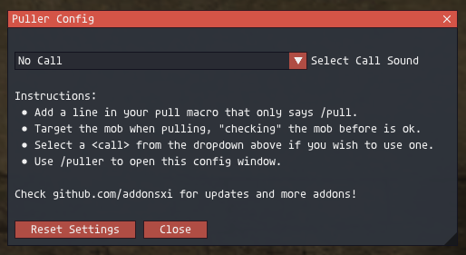

# puller

## Overview

Puller is an addon for FFXI / Ashita v4 that enhances the pulling experience by sharing full mob details directly in party chat. If you're familiar with the **Checker** addon, **Puller** will feel similar but with the added benefit of broadcasting the entire Checker mob details to your party during a pull. No more yelling in voice chat that "this one is Incredibly Tough!"

Puller works perfectly alongside **Checker**, though it doesn't require Checker to function. Checker shows mob stats like name, level, difficulty, evasion, and defense when you use `/check`. Puller extends this functionality by sharing all of those details with your party when you're ready to pull, allowing everyone to stay updated on the mob's information without needing additional separate pull calls or voice chat.

## Features

- **Party Communication**: Automatically shares mob details with your party when pulling
- **Checker Integration**: Works seamlessly with the Checker addon (optional)
- **Mob Information**: Displays mob name, level, difficulty, and attributes in party chat
- **Customizable Sounds**: Choose from 21 different call sounds to play during pulls
- **Easy Integration**: Simple `/pull` command that fits into any pull macro

## Installation

1. Place the `puller` folder in your `Game/addons/` directory
2. Use `/addon load puller` or add the addon to your default script to load every game launch

## Commands

- `/puller` - Opens the configuration menu for customizing settings
- `/pull` - Broadcasts mob details to your party (add this to your pull macro)

## Configuration

Access the configuration menu using `/puller` to customize:

- **Call Sound**: Choose from 21 different call sounds to play during pulls

Settings are automatically saved when changed. Use the Reset Settings button to restore defaults.



## How It Works

1. Target the mob you want to pull
2. Use `/pull` in your pull macro (e.g., before using Provoke)
3. Puller captures the mob's information from your target
4. The following information is automatically broadcast to your party:
   - Mob Name and Level
   - Difficulty (e.g., "Too Weak", "Tough")
   - Attributes (high/low evasion or defense)
   - Optional call sound plays if configured

### Example Macro

```
/pull
/ja "Provoke" <t>
```

## Notes

- Works with or without the Checker addon
- Make sure the mob is targeted before using `/pull`
- Settings are saved per character
- To disable the addon, use `/addon unload puller`

## Potential Roadmap

- Chain timers
- Message customization
- Option to hide some mob data

## Credits

This addon is a modified version of the Checker addon by atom0s. Special thanks to atom0s for the original implementation that this addon is based on.

More addons @ https://github.com/AddonsXI