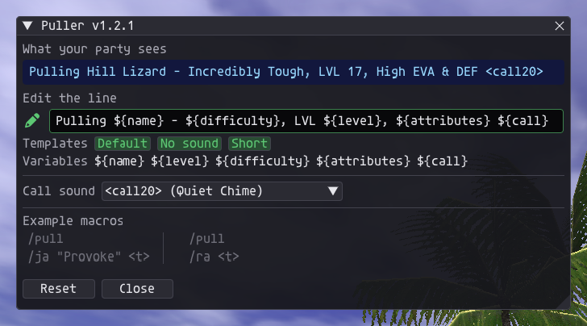

# puller v1.2.0

Announces the mob you are pulling to party chat, with its level, difficulty and defenses.



## Install

Drop the folder into `Game/addons/` and type `/addon load puller`.

## Commands

- `/pull` announces your target. Put it on its own line in your pull macro, above the line that does the pulling.
- `/puller` opens the config window.

## Example macro

```
/pull
/ja "Provoke" <t>
```

## Notes

- Write your own party line in the config window, with the mob name, level, difficulty, defenses and a call sound dropped in wherever you like.
- Pick one of 21 call sounds, or none.
- Target the mob before you pull. Checking it first is fine.
- Works alongside Checker and does not need it.
- Settings are saved per character.

## Credits

Based on the [Checker](https://github.com/AshitaXI/Ashita-v4beta/tree/main/addons/checker) addon by atom0s.

More addons @ https://github.com/AddonsXI
